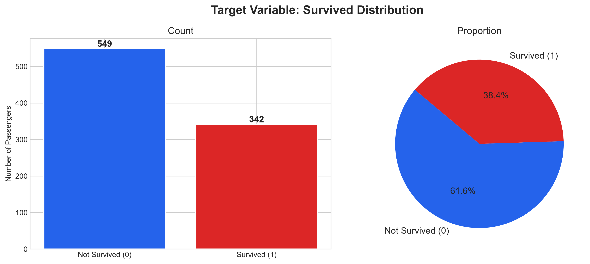
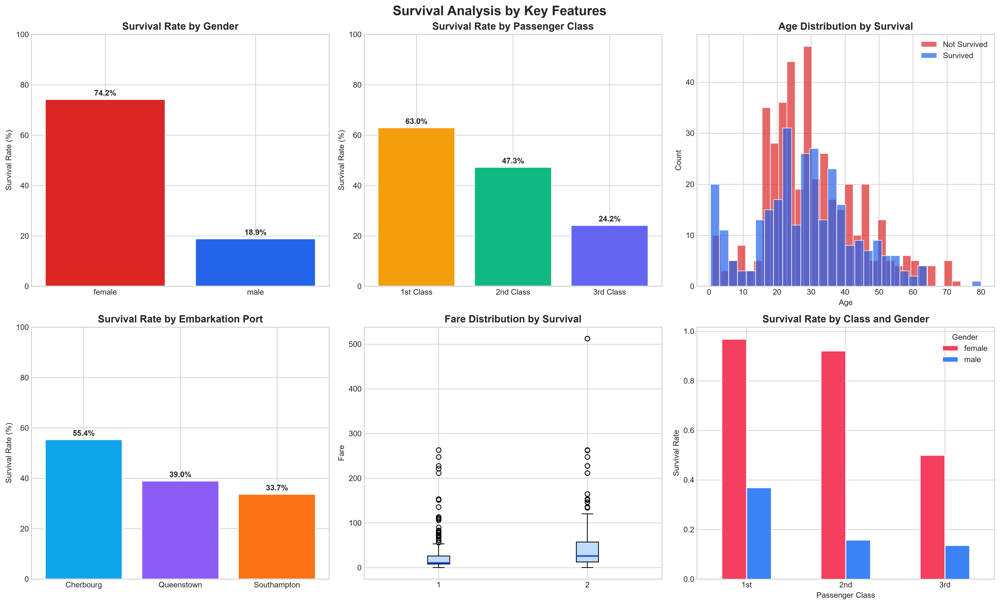
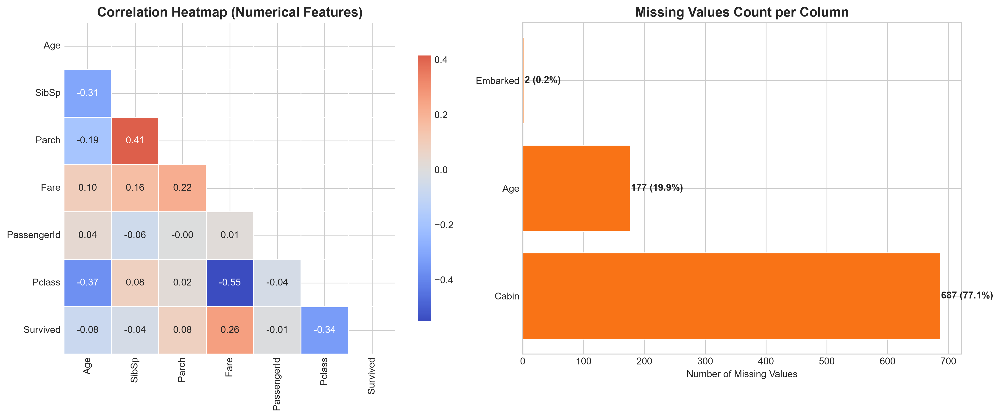
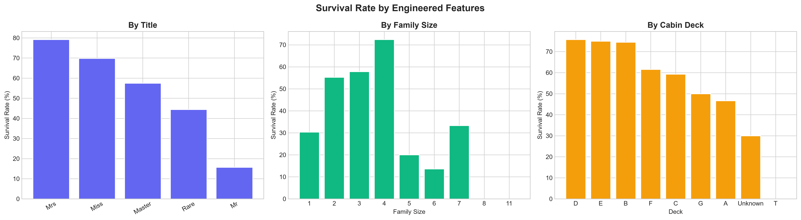
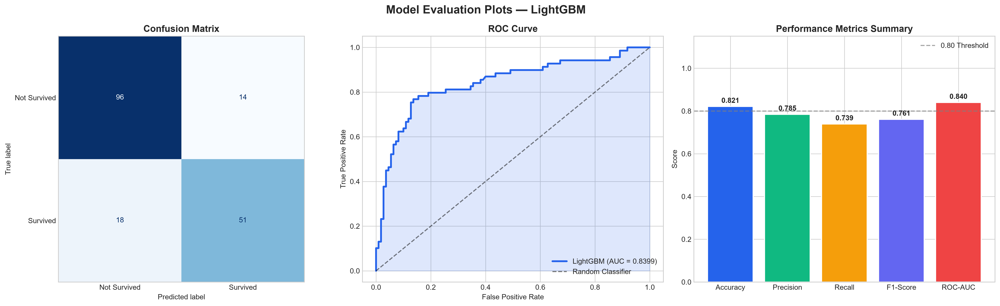
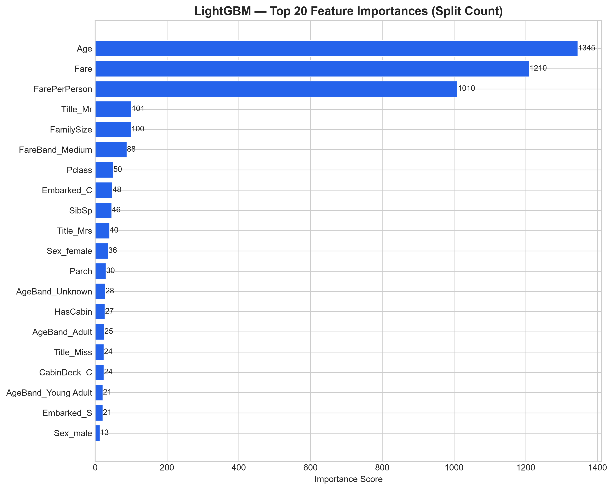
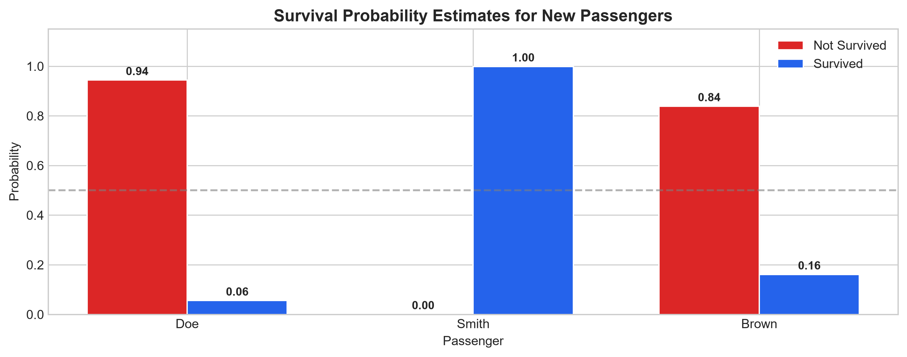

# 🚢 Titanic Passenger Survival Prediction

[](https://www.python.org/)
[](https://lightgbm.readthedocs.io/)
[](https://scikit-learn.org/)
[](https://opensource.org/licenses/MIT)

An end-to-end Machine Learning project to predict passenger survival on the Titanic using **LightGBM (Light Gradient Boosting Machine)**. This project demonstrates a production-grade machine learning workflow featuring extensive Exploratory Data Analysis (EDA), domain-driven Feature Engineering, an automated scikit-learn Preprocessing Pipeline, Hyperparameter Optimization, and Model Serialization for inference.

---

## 📌 Table of Contents

- [Project Overview](#-project-overview)
- [Key Results](#-key-results)
- [Repository Structure](#-repository-structure)
- [Dataset Overview](#-dataset-overview)
- [Machine Learning Pipeline](#-machine-learning-pipeline)
  - [1. Exploratory Data Analysis (EDA)](#1-exploratory-data-analysis-eda)
  - [2. Feature Engineering](#2-feature-engineering)
  - [3. Preprocessing Pipeline](#3-preprocessing-pipeline)
  - [4. Model Training & Tuning](#4-model-training--tuning)
  - [5. Evaluation](#5-evaluation)
- [Visualizations](#-visualizations)
- [Quick Start](#-quick-start)
  - [Prerequisites](#prerequisites)
  - [Installation](#installation)
  - [Running the Notebook](#running-the-notebook)
  - [Model Inference Example](#model-inference-example)
- [Saved Artifacts](#-saved-artifacts)
- [Author & License](#-author--license)

---

## 🎯 Project Overview

The sinking of the Titanic is one of the most infamous shipwrecks in history. While there was an element of luck involved in surviving, evidence suggests certain groups of people (women, children, and upper-class passengers) were more likely to survive than others.

This project implements **LightGBM**, a high-performance gradient boosting framework based on decision trees with leaf-wise expansion, to classify whether a given passenger survived the disaster.

### Why LightGBM?
- **Histogram-based Binning:** Drastically reduces memory usage and speeds up training.
- **Leaf-wise (Best-first) Growth:** Achieves lower loss and higher accuracy compared to traditional level-wise tree growth.
- **Seamless Pipeline Integration:** Encapsulated inside a scikit-learn `Pipeline` to eliminate data leakage.

---

## 🏆 Key Results

The tuned LightGBM model was evaluated on a held-out test set (20% split, stratified by target):

| Metric | Score | Performance Bar |
|---|---|---|
| **Cross-Validation ROC-AUC** | **0.8948** | `█████████████████░░` |
| **Test Accuracy** | **82.12%** | `████████████████░░░` |
| **Test Precision** | **78.46%** | `███████████████░░░░` |
| **Test Recall** | **73.91%** | `██████████████░░░░░` |
| **Test F1-Score** | **76.12%** | `███████████████░░░░` |
| **Test ROC-AUC** | **83.99%** | `████████████████░░░` |

---

## 📂 Repository Structure

```text
Titanic-Passenger-Survival-Prediction/
├── Dataset/
│   └── Titanic-Dataset.csv             # Raw Titanic passenger dataset (891 rows)
├── Model/
│   ├── Figures/                        # High-resolution output plots from pipeline
│   │   ├── target_distribution.png
│   │   ├── survival_by_features.png
│   │   ├── correlation_and_missing_values.png
│   │   ├── engineered_features_survival.png
│   │   ├── model_evaluation_metrics.png
│   │   ├── feature_importance.png
│   │   └── inference_probabilities.png
│   └── titanic_survival_lgbm.ipynb     # Complete end-to-end Jupyter Notebook
├── Saved_Model/                        # Serialized model artifacts for deployment
│   ├── lgbm_titanic_pipeline.pkl       # Full pipeline (Preprocessor + Model)
│   ├── lgbm_titanic_model_only.pkl     # Trained LightGBM classifier object
│   ├── feature_names.pkl               # Post-processed feature names list
│   └── model_metadata.pkl              # Training metadata and evaluation scores
├── README.md
└── requirements.txt
```

---

## 📊 Dataset Overview

The dataset contains demographics and traveling details for 891 passengers:

| Feature | Type | Description |
|---|---|---|
| `PassengerId` | Numerical | Unique identifier for each passenger |
| `Survived` | Binary (Target) | 0 = Did not survive, 1 = Survived |
| `Pclass` | Categorical | Ticket class (1 = 1st, 2 = 2nd, 3 = 3rd) |
| `Name` | Text | Full name of the passenger (including titles) |
| `Sex` | Categorical | Passenger gender (`male`, `female`) |
| `Age` | Numerical | Age in years (fractional if < 1) |
| `SibSp` | Numerical | Number of siblings/spouses aboard |
| `Parch` | Numerical | Number of parents/children aboard |
| `Ticket` | Text | Ticket number string |
| `Fare` | Numerical | Passenger fare paid |
| `Cabin` | Text | Cabin number |
| `Embarked` | Categorical | Port of embarkation (`C` = Cherbourg, `Q` = Queenstown, `S` = Southampton) |

---

## ⚙️ Machine Learning Pipeline

### 1. Exploratory Data Analysis (EDA)
- Analyzed class balance: **38.38% survived** vs **61.62% deceased**.
- Uncovered key relationships:
  - Female passengers had a **~74% survival rate** compared to **~19% for males**.
  - 1st Class passengers had a **~63% survival rate** compared to **~24% for 3rd Class**.
  - Passengers embarking at Cherbourg exhibited higher survival due to a higher proportion of 1st Class bookings.

### 2. Feature Engineering
We engineered 8 domain-specific features from the raw data:

- `Title`: Extracted from `Name` (e.g., *Mr, Mrs, Miss, Master, Rare*).
- `FamilySize`: Calculated as `SibSp + Parch + 1`.
- `IsAlone`: Binary indicator (`1` if `FamilySize == 1`, else `0`).
- `HasCabin`: Binary indicator (`1` if `Cabin` is recorded, else `0`).
- `CabinDeck`: First letter extracted from `Cabin` (or `Unknown`).
- `AgeBand`: Discretized age brackets (*Child, Teenager, Young Adult, Adult, Senior*).
- `FareBand`: Discretized fare brackets (*Low, Medium, High, Very High*).
- `FarePerPerson`: Normalized fare `Fare / FamilySize`.

### 3. Preprocessing Pipeline
Built with **scikit-learn `ColumnTransformer`**:
- **Numerical Pipeline:** `SimpleImputer(strategy='median')` ➔ `StandardScaler()`
- **Categorical Pipeline:** `SimpleImputer(strategy='most_frequent')` ➔ `OneHotEncoder(handle_unknown='ignore')`

### 4. Model Training & Tuning
- **Algorithm:** `lightgbm.LGBMClassifier`
- **Optimization:** `RandomizedSearchCV` with 50 iterations and 5-Fold Stratified Cross-Validation maximizing `ROC-AUC`.
- **Optimal Hyperparameters:**
  - `n_estimators`: 783
  - `learning_rate`: ~0.144
  - `num_leaves`: 54
  - `max_depth`: 7
  - `min_child_samples`: 39
  - `colsample_bytree`: ~0.748
  - `subsample`: ~0.885
  - `reg_alpha`: ~0.472
  - `reg_lambda`: ~0.120

---

## 📈 Visualizations

### 1. Target Distribution & Survival by Key Features
<p align="center">
  
  
</p>

### 2. Correlation Matrix & Missing Value Profile
<p align="center">
  
</p>

### 3. Survival Rate by Engineered Features
<p align="center">
  
</p>

### 4. Model Evaluation & Feature Importance
<p align="center">
  
  
</p>

### 5. Single / Batch Inference Probabilities
<p align="center">
  
</p>

---

## 🚀 Quick Start

### Prerequisites
- Python 3.10+
- Git

### Installation

1. **Clone the repository:**
   ```bash
   git clone https://github.com/NumiKun/Titanic-Passenger-Survival-Prediction.git
   cd "Titanic Passenger Survival Prediction"
   ```

2. **Create a virtual environment:**
   ```bash
   python -m venv venv
   # On Windows:
   venv\Scripts\activate
   # On macOS/Linux:
   source venv/bin/activate
   ```

3. **Install dependencies:**
   ```bash
   pip install -r requirements.txt
   ```

### Running the Notebook

Launch Jupyter Notebook and open the pipeline file:
```bash
jupyter notebook Model/titanic_survival_lgbm.ipynb
```

---

### 🔮 Model Inference Example

Use the saved production pipeline to make predictions on new passenger data:

```python
import joblib
import pandas as pd
import numpy as np

# 1. Load serialized pipeline
pipeline = joblib.load("Saved_Model/lgbm_titanic_pipeline.pkl")

# 2. Define feature engineering function
def engineer_features(data):
    df_fe = data.copy()
    df_fe["Title"] = df_fe["Name"].str.extract(r",\s*([^.]+)\.", expand=False).str.strip()
    rare_titles = df_fe["Title"].value_counts()[df_fe["Title"].value_counts() < 10].index
    df_fe["Title"] = df_fe["Title"].replace(rare_titles, "Rare")
    df_fe["Title"] = df_fe["Title"].replace({"Mlle": "Miss", "Ms": "Miss", "Mme": "Mrs"})
    df_fe["FamilySize"] = df_fe["SibSp"] + df_fe["Parch"] + 1
    df_fe["IsAlone"] = (df_fe["FamilySize"] == 1).astype(int)
    df_fe["HasCabin"] = df_fe["Cabin"].notna().astype(int)
    df_fe["CabinDeck"] = df_fe["Cabin"].str[0].fillna("Unknown")

    _age_conds = [
        df_fe["Age"] <= 12,
        (df_fe["Age"] > 12) & (df_fe["Age"] <= 18),
        (df_fe["Age"] > 18) & (df_fe["Age"] <= 35),
        (df_fe["Age"] > 35) & (df_fe["Age"] <= 60),
        df_fe["Age"] > 60,
    ]
    df_fe["AgeBand"] = np.select(_age_conds, ["Child", "Teenager", "Young Adult", "Adult", "Senior"], default="Unknown")

    _fare_conds = [
        df_fe["Fare"] <= 7.91,
        (df_fe["Fare"] > 7.91) & (df_fe["Fare"] <= 14.454),
        (df_fe["Fare"] > 14.454) & (df_fe["Fare"] <= 31.0),
        df_fe["Fare"] > 31.0,
    ]
    df_fe["FareBand"] = np.select(_fare_conds, ["Low", "Medium", "High", "Very High"], default="Low")
    df_fe["FarePerPerson"] = df_fe["Fare"] / df_fe["FamilySize"]
    return df_fe

# 3. New passenger input
new_passenger = {
    "Name": "Astor, Mrs. John Jacob (Madeleine Talmadge Force)",
    "Sex": "female",
    "Age": 18.0,
    "SibSp": 1,
    "Parch": 0,
    "Embarked": "C",
    "Ticket": "17757",
    "Fare": 227.525,
    "Cabin": "C62",
    "Pclass": 1
}

# 4. Transform & Predict
input_df = engineer_features(pd.DataFrame([new_passenger]))
prediction = pipeline.predict(input_df)[0]
probability = pipeline.predict_proba(input_df)[0]

print(f"Prediction : {'Survived' if prediction == 1 else 'Not Survived'}")
print(f"Probability: Survived = {probability[1]:.2%}, Deceased = {probability[0]:.2%}")
```

---

## 📦 Saved Artifacts

All trained models and knowledge artifacts are stored in [`Saved_Model/`](Saved_Model/):

- `lgbm_titanic_pipeline.pkl`: Full end-to-end preprocessing & LightGBM model pipeline.
- `lgbm_titanic_model_only.pkl`: LightGBM Classifier instance.
- `feature_names.pkl`: List of 38 feature names after One-Hot Encoding and transformation.
- `model_metadata.pkl`: Dictionary containing CV scores, test set metrics, best parameters, and dataset shapes.

---

## 👤 Author & License

Developed as part of a Data Science & Machine Learning Portfolio.

This project is licensed under the **MIT License** — feel free to use and adapt this code for your own projects.
